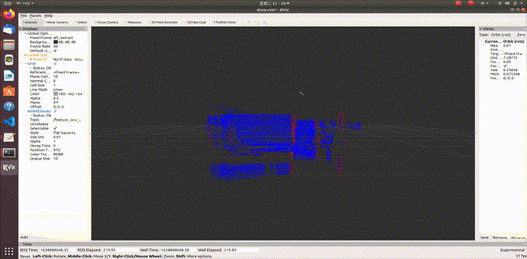

# 激光雷达点云滤波和特征提取
## 一、介绍
在激光雷达里程计和建图(Lidar Odometry and Mapping， LOAM)任务中，前端在里程计计算位姿前需要对传感器的点云流数据进行滤波(去除噪点)和特征提取处理。

其中点云滤波往往需要根据激光雷达具体的扫描方式、型号、特性以及后续任务等进行调整<sup>[4]</sup>；在点云特征提取方面，论文<sup>[3]</sup>中率先提出了将点云曲率较大的边缘点(Edge Points)和曲率较小的平面点(Planar Points)作为点云的特征，进行后续ICP匹配，从而减少内存消耗量，后续LOAM论文基本沿用这一方法。

本仓库参考Horizon loam<sup>[5]</sup>中的点云滤波和特征点提取方法,其中Horizon激光雷达CustomMsg的Tag信息<sup>[7]</sup>可以用于基本的滤波操作。

调试环境：

* Ubuntu 18.04 ROS melodic. [ROS installation](http://wiki.ros.org/ROS/Installation)
* PCL 1.8. [PCL installation](https://pointclouds.org/downloads/#linux)
* 硬件: livox Horizon激光雷达 

## 二、使用方法

1. 安装ROS
2. 安装livox ROS驱动<sup>[1, 2, 3]</sup>
3. 安装本仓库
```
mkdir -p ~/xxx/src
cd ~/xxx/src
catkin_init_workspace
git clone https://github.com/GCaptainNemo/fusion-lidar-camera-ROS.git
cd ..
catkin_make
```
4. 运行激光雷达设备驱动

```
roslaunch livox_ros_driver livox_lidar_msg.launch
```

5. 运行filter_node和extract_feature_node节点，并在rviz中显示
```
roslaunch filter_extract_feature launch_filter_extract.launch
```

## 三、效果
<p align="center"></p>
<h6 align="center">提取边缘点(红色)和平面点(蓝色)</h6>

## 四、参考资料
[1] [livox 驱动安装](https://github.com/Livox-SDK/livox_ros_driver)

[2] [livox SDK安装](https://github.com/Livox-SDK/Livox-SDK)

[3] Ji Z , Singh S . LOAM: Lidar Odometry and Mapping in Real-time[C]// Robotics: Science and Systems Conference. 2014.

[4] Lin J ,  Zhang F . Loam_livox: A fast, robust, high-precision LiDAR  odometry and mapping package for LiDARs of small FoV[J].  2019.

[5] [livox-horizon-loam](https://github.com/Livox-SDK/livox_horizon_loam)

[6] [livox-CustomPoint格式](http://docs.ros.org/en/kinetic/api/livox_ros_driver/html/msg/CustomPoint.html)
  
[7] [livox-CustomPoint-tag信息含义](https://livox-wiki-cn.readthedocs.io/zh_CN/latest/introduction/Point_Cloud_Characteristics_and_Coordinate_System%20.html)
